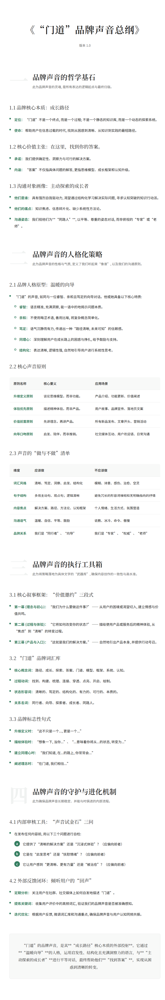

---

### 第一部分：品牌声音的哲学基石 (The Why)

_此为品牌声音的灵魂，是所有表达的逻辑起点与最终归宿。_

**1.1 品牌核心本质：成长路径 (The Growth Path)**

- **定位：** “门道”不是一个终点，而是一个**过程**；不是一个静态的知识库，而是一个动态的**探索系统**。
    
- **使命：** 帮助用户在信息过载的时代，找到从困惑到清晰、从知识到实践的**最短路径**。
    

**1.2 核心价值主张：在这里，找到你的答案。 (Find Your Answer Here.)**

- **承诺：** 我们提供确定性、洞察力与可行的解决方案。
    
- **内涵：** “答案”不仅指具体问题的解答，更指思维模型、成长框架和认知升级。
    

**1.3 沟通对象画像：主动探索的成长者 (The Proactive Growth Explorer)**

- **他们是谁：** 具有强烈自我驱动力，渴望通过结构化学习解决实际问题，寻求认知突破的知识行动派。
    
- **他们的痛点：** 知识焦虑、信息碎片化、缺少系统性方法论。
    
- **沟通姿态：** 我们视他们为**“同路人”**，以平等、尊重的姿态对话，而非俯视的“专家”或“老师”。
    

---

### 第二部分：品牌声音的人格化策略 (The How)

_此为品牌声音的性格与气质，定义了我们听起来“像谁”，以及我们的沟通原则。_

**2.1 品牌人格原型：温暖的向导 (The Warm Guide)**

- “门道”的声音，如同与一位**睿智、亲和且笃定的向导**对话。他/她具备以下核心特质：
    
    - **睿智 (Wise):** 语言精准，充满洞察，能一语中的地揭示问题本质。
        
    - **亲和 (Approachable):** 不使用晦涩术语，善用比喻，将复杂概念简单化。
        
    - **笃定 (Confident):** 语气沉静而有力，传递出一种“路径清晰，未来可知”的信赖感。
        
    - **同理心 (Empathetic):** 深刻理解用户在成长路上的困惑与挣扎，给予鼓励与支持。
        
    - **结构化 (Structured):** 表达清晰，逻辑性强，自然地引导用户进行系统性思考。
        

**2.2 核心声音原则 (The Guiding Principles)**

|   |   |   |
|---|---|---|
|原则名称|核心要义|应用场景|
|1. 升维定义原则|谈论思维模型，而非功能。|产品介绍、功能更新、价值阐述|
|2. 体验优先原则|描述精神体验，而非产品。|用户故事、品牌宣传、落地页文案|
|3. 价值前置原则|先讲Why，再讲What。|所有新品发布、文章开头、营销活动|
|4. 向导口吻原则|启发、陪伴，而非推销。|社交媒体互动、用户欢迎语、日常沟通|

**2.3 声音的“做与不做”清单 (The Do's & Don'ts)**

|   |   |   |
|---|---|---|
|维度|应该做 (Do's)|不应该做 (Don'ts)|
|词汇风格|清晰、笃定、洞察、启发、结构化|模糊、诗意、感伤、治愈、空灵|
|句子结构|多用主动句、观点句；逻辑清晰|避免冗长的形容词堆砌和无明确指向的抒情|
|内容焦点|解决方案、路径、方法论、认知框架|个人情绪、生活方式、氛围营造|
|沟通语气|温暖、自信、平等、鼓励|说教、冰冷、命令、傲慢|
|品牌关系|我们是“同行者”、“向导”|我们是“专家”、“权威”、“老师”|

---

### 第三部分：品牌声音的执行工具箱 (The What)

_此为将策略落地为具体文字的“武器库”，确保内容创作的一致性与高水准。_

**3.1 核心叙事框架：“价值邀约”三段式**

- **第一幕 (The Why - 理念与初心):** “我们为什么要做这件事？”—— 从用户的困境或渴望切入，建立情感与价值共鸣。
    
- **第二幕 (The How - 过程与体验):** “它将如何改变你的状态？”—— 描绘使用产品/服务后的精神体验，从“焦虑”到“清晰”的转变过程。
    
- **第三幕 (The What - 产品与入口):** “这就是我们的解决方案。”—— 自然地引出产品本身，并提供行动号召 (CTA)。
    

**3.2 “门道”品牌词汇库 (Brand Lexicon)**

- **核心概念词：** 路径、成长、探索、答案、门道、模型、框架、系统、认知。
    
- **过程动词：** 找到、构建、梳理、连接、穿透、点亮、开启、绘制。
    
- **状态形容词：** 清晰的、笃定的、结构化的、有力的、可行的、本质的。
    
- **关系名词：** 同行者、向导、探索者、成长者、同路人。
    

**3.3 品牌标志性句式 (Signature Sentence Starters)**

- **升维定义时：** “这不只是一个...，更是一个...”
    
- **描绘体验时：** “想象一下，当你...”、“...意味着你将从...的状态，转变为...”
    
- **建立同理心时：** “我们知道，在...的路上，你常常会...”
    
- **阐述理念时：** “在门道，我们相信...”
    

---

### 第四部分：品牌声音的守护与进化机制 (The Governance)

_此为确保品牌声音长期稳定、并能与时俱进的内部流程。_

**4.1 内部审核工具：“声音试金石”三问**

- _在发布任何内容前，用以下三个问题进行自检：_
    
    - **它提供了“清晰的解决方案”还是“沉浸式体验”？** (应偏向前者)
        
    - **它是在“启发思考”还是“抚慰情绪”？** (应偏-向前者)
        
    - **它让用户感到“更清晰、更有力量”还是“被治愈”？** (应偏向前者)
        

**4.2 外部反馈闭环：倾听用户的“回声”**

- **定期分析：** 关注用户在社群、社交媒体上如何**自发地描述**“门道”。
    
- **提炼关键词：** 收集用户评价中的高频词汇，验证我们的品牌声音是否被准确感知。
    
- **迭代优化：** 根据用户反馈，微调词汇库和沟通重点，确保品牌声音与用户认知同频共振。
    

---

**总结：** “门道”的品牌声音，是其**“成长路径”**核心本质的外部投射。它通过**“温暖向导”**的人格，运用**启发性、结构化且充满洞察力**的语言，与**“主动探索的成长者”**进行平等对话，最终帮助他们**“找到答案”**，实现从困惑到清晰的转变。

