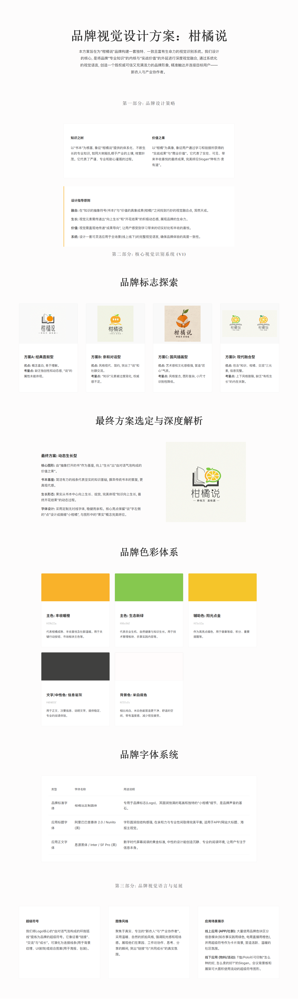

本方案旨在为“柑橘说”品牌构建一套独特、一致且富有生命力的视觉识别系统。我们设计的核心，是将品牌“专业知识”的内核与“实战价值”的外延进行深度视觉融合，通过系统化的视觉语言，创造一个既权威可信又充满活力的品牌形象，精准触达并连接目标用户——新农人与产业协作者。

---

### 第一部分：品牌设计策略

**1.1 核心概念：知识之树，价值之果**

这个核心概念非常精准，富有哲学意味，我们将沿用并强化它：

- **知识之树**: 以“书本”为根基，象征“柑橘说”提供的体系化、不断生长的专业知识，如同大树般扎根于产业的土壤，枝繁叶茂。它代表了严谨、专业和耐心灌溉的过程。
    
- **价值之果**: 以“柑橘”为具象，象征用户通过学习和链接所获得的“**实战成果**”与“**商业价值**”。它代表了实在、可见、带来丰收喜悦的最终成果，完美呼应Slogan“**种有方·卖有道**”。
    

**1.2 设计指导原则**

所有视觉设计将遵循以下四大原则：

- **融合**: 在“知识的抽象符号（书本）”与“价值的具象成果（柑橘）”之间找到巧妙的视觉融合点，浑然天成。
    
- **生长** : 视觉元素需传递出“向上生长”和“开花结果”的积极动态感，展现品牌的生命力。
    
- **价值**: 视觉需直观地传递“成果导向”，让用户感受到学习带来的切实好处和丰收的喜悦。
    
- **系统**: 设计一套可灵活应用于全场景（线上线下）的完整视觉语言，确保品牌体验的高度一致性。
    

### 第二部分：核心视觉识别系统 (VI)

**2.1 品牌标志探索与最终方案**

在确定最终品牌标志前，我们探索了多个不同方向的设计概念，旨在找到最能精准传达“知识之树，价值之果”核心理念，并兼具独创性与现代感的视觉符号。以下是几个代表性的方案及其分析。

---

#### 方案探索

**方案A: 经典直叙型**

- **设计描述**: 直接将“打开的书本”与“完整的柑橘”两个核心元素进行叠加组合。
    
- **优点**: 概念直白，易于理解，用户可以第一时间识别出“知识”与“柑橘”两大主题。
    
- **考量点**: 元素组合较为常规，缺乏独创性和动态感，难以形成独特的品牌记忆点。“说”（交流、社群）的属性未能有效体现。
    

**方案B: 亲和对话型**

- **设计描述**: 将“柑橘”与“对话气泡”进行创意结合，下方用抽象的波浪线代表“书本”或“土地”。
    
- **优点**: 风格现代、简约、亲和力强，重点突出了“说”和社群交流的核心。
    
- 考量点**: “书本”或“知识”的元素被过度简化，品牌关于“体系化知识”的专业感和深度有所削弱。整体形态略显轻盈，权威感不足。
    

**方案C: 国风插画型**

- **设计描述**: 采用质感强烈的插画风格，将一个打开的书本巧妙地融入柑橘的果实形态中，配以手写风格字体。
    
- **优点**: 艺术感和文化感极强，能营造出一种“匠心”、“秘籍”的独特气质，具有很高的审美价值。
    
- **考量点**: 风格较为复古和厚重，可能与线上社群、现代农业科技的定位有一定距离感。图形较为复杂，在小尺寸应用（如APP图标）中识别性会降低。
    

**方案D: 现代融合型**

_(此方案包含两种色彩变体)_

- **设计描述**: 将现代感的“对话气泡+柑橘切片”图形，与一个相对写实风格的“打开的书本”图标进行上下组合。
    
- **优点**: 成功地将“知识”、“柑橘”、“交流”三个元素都包含在内，信息传达较为完整。
    
- **考量点**: 上下两部分的设计风格存在一定的割裂感。上方的扁平化图形与下方的线性描边书本像是两个独立元素的简单叠加，缺乏“有机生长”的内在关联，整体的融合度与独创性有待提升。
    

  

---

#### 最终方案选定与深度解析

经过对以上方案的综合评估，我们最终确定以下方案作为“柑橘说”的正式品牌标志。它在**概念传达的深度、视觉的独创性**以及**未来系统延展性**上表现最为出色。

**最终方案: 动态生长型**

**A. 图形设计：知识生长的果实**

- **核心图形**: 我们的LOGO主体由**“一本抽象化、现代感的打开的书”作为基座，向上“生长”出一个“由对话气泡构成的价值之果”**。
    
- **书本基座**: 图形底部是两片高度概括的书页，线条简洁有力。它代表了品牌坚实的知识基础和专业根基，摒弃了传统书本的繁复，更具现代感和符号感。
    
- **生长形态**: 从书本的中心，一个包含“交流”与“价值”的果实向上生长、绽放。这完美体现了“知识向上生长，最终开花结果”的动态过程，赋予了品牌无限的生命力。
    
- **对话价值之果**: 上方的图形是整个设计的灵魂。
    
    - **形态**: 它是一个“对话气泡”，诠释了“说”的社群交流属性。
        
    - **内容**: 气泡内部是“柑橘切片”，代表了最终的“商业价值”与“实战成果”。
        
    - **色彩**: **生态新绿**的轮廓线代表“生长”与“方法”，**丰收暖橙**的内圈线和叶子代表“成熟”与“喜悦”，色彩本身就在讲述故事。
        
- **整体感受**: 这个标志不再是元素的拼接，而是**有机的融合**。它讲述了一个完整的故事：**“在知识的土壤上，通过交流与分享，结出价值的果实。”** 整个Logo既独特、巧妙，又高度概括了品牌的核心价值，拥有极强的识别度和延展性。
    

**B. 字体设计：“柑橘说”定制字体**

- **字体风格**: 我们采用了一款定制的无衬线字体，结构稳健，转角微圆角处理，在确保现代感与易读性的同时，传递出品牌的亲和力。
    
- **核心亮点 (视觉彩蛋)**: 保留了“说”字左侧“言”字旁第一笔“点”设计成一个**微缩“小柑橘”**的方案。这个巧妙的细节与图形Logo中的“果实”概念形成了完美的呼应，极大地增强了整套标志的系统性、趣味性和独特性。
    

**结论**: 最终选定的“动态生长型”方案，是所有探索方案中的集大成者。它不仅在视觉上最美观、最现代，更重要的是，它以一种极富创意和逻辑性的方式，将品牌复杂的内涵（知识、社群、价值、生长）完美地熔于一炉，为后续整个品牌视觉系统的延展（如超级符号、应用设计等）提供了最坚实、最富潜力的基础。

  

**2.2 品牌色彩体系：阳光风土之境**

色彩是品牌情感传递最直接的方式。我们为“柑橘说”构建的色彩体系，源于阳光、土壤与果实，旨在传递一种充满希望的丰收喜悦与扎实的生长信赖感。

**A. 主色**

主色是品牌的核心识别色，定义了品牌的基本调性。

- **丰收暖橙**
    
    - **HEX**: `#f9b22a`
        
    - **寓意**: 代表柑橘的成熟、丰收的喜悦以及社群的温暖与活力。这是品牌情感的制高点，激发用户的参与热情和对成功的向往。
        
    - **应用**: 作为品牌最主要的强调色。用于**关键行动按钮**、**“市场与销售”板块主色**、**电商直播场景**、选中状态、视觉焦点等，直接驱动用户行为。
        
- **生态新绿**
    
    - **HEX**: `#86c84f`
        
    - **寓意**: 代表农业的生机、自然健康与知识的生长。它传递出专业、可靠、充满生命力的信赖感，象征着科学的种植方法和可持续发展。
        
    - **应用**: 用于**“技术与管理”板块主色**、**农事实践内容**、积极状态提示（如“已完成”）、内容标签（如“有机”），构建专业可靠的氛围。
        

**B. 辅助色**

辅助色用于丰富视觉层次，确保信息传达的清晰性。

- **阳光点金**
    
    - **HEX**: `#f5c52a`
        
    - **用途**: 作为高亮点缀色。用于**徽章等级、积分、重要提醒**等，为界面增加明快感和价值感，让用户的成就和收益“看得见”。
        
- **信息岩灰**
    
    - **HEX**: `#40403f`
        
    - **用途**: 用于**正文、次要信息、说明文字**。提供稳定、专业的阅读体验，确保在大段文字阅读时用户能保持专注，不被色彩干扰。
        
- **米白底色**
    
    - **HEX**: `#fffcfc`
        
    - **用途**: 作为界面的主要背景色。相比纯白，米白色能营造更干净、舒适、有呼吸感的视觉空间，带有温度感，减少长时间观看的视觉疲劳。
        

**C. 色彩使用原则**

为保证品牌视觉一致性，建议遵循“60-30-10”色彩搭配原则：

- **60% 米白底色/信息岩灰**: 作为基础，保证界面的清爽和信息的可读性。
    
- **30% 生态新绿**: 用于内容模块、信息分类等，建立专业的基调。
    
- **10% 丰收暖橙/阳光点金**: 作为强调色和点缀，用于需要用户关注和操作的关键位置，引导视觉流向。
    

  

**2.3 品牌字体系统：温暖的对话，清晰的价值**

- **品牌标准字体**: **柑橘说定制圆体**，专用于品牌标志(Logo)，其圆润饱满的笔画和独特的“小柑橘”细节，是品牌声音的基石。
    
- **应用字体系统**:
    
    - **标题字体**: **阿里巴巴普惠体 2.0** (中) / **Nunito** (英)。字形圆润但结构感强，在亲和力与专业性间取得完美平衡，适用于APP/网站的大标题、海报主视觉等。
        
    - **正文字体**: **思源黑体 / PingFang SC** (中) / **Inter / SF Pro** (英)。作为数字时代屏幕阅读的黄金标准，中性的设计能创造沉静、专业的阅读环境，让用户专注于信息本身，体现品牌“提供可靠价值”的专业一面。
        

---

### 第三部分：品牌视觉语言与延展

**3.1 超级符号**

我们将Logo核心的“**由对话气泡构成的环抱弧线**”提炼为品牌的超级符号。它象征着“**链接**”、“**交流**”与“**成长**”。

- **演化形式**:
    
    - **连接线条**: 作为背景纹理、UI卡片装饰、分割线，象征信息的流动与产业的链接。
        
    - **组合图案**: 重复、旋转组合成类似叶脉或果肉的纹理，大面积应用于海报、包装等，增强品牌专属感和视觉冲击力。
        

**3.2 图像风格**

聚焦于真实、专注的“**新农人**”与“**产业协作者**”。

- **风格**: 采用**温暖、自然的抓拍风格**，强调**阳光感**和**现场感**。避免过度摆拍和修饰。
    
- **内容**: 展现他们在果园、工作坊、交流会中协作、思考、分享的瞬间，突出“链接”与“共同成长”的真实氛围。
    

**3.3 应用场景展示**

- **线上应用 (APP/社群)**: 大量使用品牌色块区分信息模块（如农事实践用绿色，电商直播用橙色），并用超级符号作为卡片背景，营造活跃、温暖的社区氛围。图标系统采用“线性描边+主色填充”的风格，保持圆角处理，与品牌调性一致。
    
- **线下应用 (物料/活动)**: T恤/Polo衫可印制“怎么种的好，怎么卖的好？”的Slogan。会议背景板和展架可大面积使用流动的超级符号图形，营造强烈的视觉冲击力和专业感。
    

