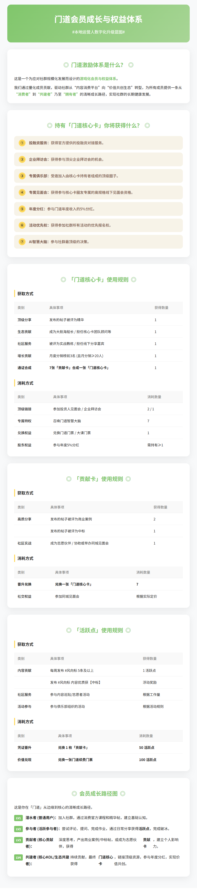
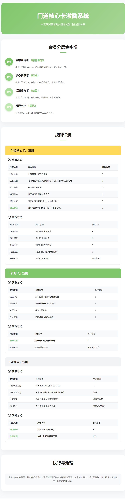

---

1. 项目概述 (Overview)
    

**1.1 设计目标:** 为应对社群规模的指数级增长，解决规模化服务、用户分层及价值稀释等核心挑战，特设计本方案。旨在通过构建一套游戏化的、基于贡献证明的会员与权益体系，驱动社群从“内容消费平台”向“价值共创生态”转型，实现社群的长期健康发展与成员的深度价值绑定。

**1.2 核心理念:**

- **社区自治:** 赋能核心成员，实现“杠杆式管理”，让社区自我调节与进化。
    
- **价值量化:** 将无形的“贡献”转化为有形的、可流通的“通-证”，使激励公平、透明。
    
- **路径清晰:** 为所有成员提供一条从“消费者”到“共建者”乃至“拥有者”的清晰成长路径。
    

---

2. 会员分层模型 (Membership Tiers Model)
    

本方案采用动态晋升的四级金字塔模型，对社群成员进行分层。

|   |   |   |   |
|---|---|---|---|
|层级|身份头衔|角色定位|核心特征|
|LV 4|生态共建者|社群的“精神股东”与核心决策层|拥有“门道核心卡”，参与社群长期利益分配与重大决策|
|LV 3 等级3|核心贡献者|社群的“KOL”与中坚执行力量|拥有“贡献卡”，持续产出高价值内容，组织社群活动|
|LV 2|活跃参与者|社群的“公民”，氛围的建设者|拥有“活跃点:”，积极互动，完成基础分享与任务|
|LV 1 等级1|普通用户|社群的“居民”，价值的消费者|付费会员，以学习和信息获取为主要目的|

---

3. 核心激励系统：双通-证经济模型
    

本体系的核心是内部发行的两种价值通-证：“门道核心卡”与“贡献卡 ”。

**3.1 通-证定义:**

- **门道核心卡 ：**
    
    - **定位:** 顶级权益通-证，代表社群最高荣誉与核心权力。
        
    - **特征:** 极度稀缺，获取难度极高，与社群长期利益深度绑定。
        
- **贡献卡：**
    
    - **定位:** 高价值贡献通-证，社群内部的“成就徽章”。
        
    - **特征:** 激励高质量UGC和社区服务，是合成“门道核心卡”的基础。
        
- **活跃点:**
    
    - **定位:** 日常活跃度通-证，社群内部的“积分”或“经验值”。
        
    - **特征:** 低门槛获取，用于激励日常互动与破冰。
        

**3.2 通-证获取规则 (Acquisition Rules):**

|   |   |   |   |
|---|---|---|---|
|获取通-证|贡献类别|具体事项|获得数量|
|门道核心卡|顶级分享|发布的帖子被评为精华|1|
||生态贡献|成为大航海船长|1|
|||担任门道核心卡团队顾问|1|
|||对门道有突出贡献|1|
|||成为门道赞助商|1|
||社区服务|被评为实战教练|1|
||线下影响|担任线下见面会分享嘉宾|1|
||增长贡献|月度分销榜前3名 (且月分销≥20人)|1|
||通-证合成|7张贡献卡合成一张门道核心卡|1|
|贡献卡|高质分享|发布的帖子被评为商业案例|2|
|||发布的帖子被评为中标|1|
||社区实战|成为志愿伙伴|1|
|||协助/举办同城见面会|1|

---

4. 权益与消耗体系 (Rights & Consumption System)
    

权益通过消耗相应的通-证来实现，为通-证提供明确的价值锚点。

|   |   |   |   |
|---|---|---|---|
|消耗通-证|权益类别|具体事项|消耗数量|
|门道核心卡|顶级链接|参加投资人见面会|2|
|||参加企业拜访会|1|
||专属特权|召唤门道智慧大脑|7|
||兑换权益|兑换N张门道门票|1|
|||兑换门道大课门票|1|
||股东权益|参与年度5%分红|需持有≥1|
|贡献卡|晋升兑换|兑换一张门道核心卡|7|
||社交权益|参加同城见面会|根据实际定价|

---

5. 用户成长路径图 (User Growth Path)
    

本方案为用户提供了清晰的、从边缘到核心的成长路径。

1. **潜水者 (LV1):** 加入社群，通过消费官方课程和精华帖，建立基础认知。
    
2. **参与者 (LV2):** 尝试评论、提问、完成作业，通过日常分享获得**活跃点**，完成破冰。
    
3. **贡献者 (LV3):** 深度思考，产出**商业案例/中标帖**，或成为**志愿伙伴**，获得**贡献卡**，建立个人影响力。
    
4. **核心KOL (LV3-LV4):** 持续贡献，积累7枚**贡献卡**，**合成第一张门道核心卡**，完成身份的关键跃迁。
    
5. **生态共建者 (LV4):** 通过顶级贡献（成为大航海船长等）直接获得更多**门道核心卡**，消耗**门道核心卡**链接顶级资源，并参与**年度分红**，实现价值共创。
    

---

6. 执行与治理
    

- **执行机构:** 成立由官方引导、核心成员组成的**志愿伙伴委员会**，负责精华评定、活动组织、新人引导等日常治理工作。
    

  

  

### 门道社区志愿者体系设计方案

**V1.0 V1.0 版本**

---

1. 项目概述 (Overview)
    

**1.1 设计目标:** 为有效支撑“**门道核心卡**”激励体系的落地，解决官方团队在社群管理、内容运营、活动组织等方面的服务半径瓶颈，特设立本志愿者体系。旨在通过招募、赋能和激励社群内的积极成员，构建一个高效、自驱的社区自治执行机构，提升整体社群的活跃度、内容质量与成员归属感。

**1.2 核心理念:**

- **从用户中来，到用户中去:** 所有志愿者均从社群付费用户中选拔，确保其对社群文化的高度认同。
    
- **服务即成长:** 志愿工作不仅是为社区贡献，更是志愿者个人学习、成长、建立影响力的最佳路径。
    
- **权责利对等:** 明确志愿者的职责、赋予其相应的权限，并将其贡献与“**门道核心卡**”激励体系深度绑定，确保付出有回报。
    

---

2. 志愿者组织架构与职责
    

本体系采用“**委员会 + 职能小组**”的扁平化组织架构，确保高效协作。

**2.1 核心管理层：志愿伙伴委员会**

- **构成:** 由官方运营团队及最高阶的志愿伙伴（如各小组领队/教练）组成。
    
- **职责:**
    
    - **战略规划:** 制定志愿者体系的季度目标与发展方向。
        
    - **规则修订:** 根据社群发展，迭代志愿者招募、晋升与激励规则。
        
    - **最终裁定:** 负责对重大社区事务（如精华帖终审、志愿者任免）进行最终决策。
        
    - **资源协调:** 协调官方资源，支持各职能小组的工作。
        

**2.2 核心执行层：职能小组 (Task Forces)**

|   |   |   |
|---|---|---|
|职能小组|核心职责 (What to do)|关键任务 (Key Tasks)|
|内容运营组|发现、筛选并放大社群内的优质内容，维护讨论氛围。|1.巡贴与推荐: 每日巡查社群帖子，发现有潜力的内容，推荐为“中标”或“精华”候选。2. 话题引导: 根据热点或官方规划，发起主题讨论，激发UGC。 3. 氛围维护: 对违规、灌水内容进行提醒或上报。|
|新人引导组|帮助新成员快速融入社群，降低启动摩擦力，提升新用户体验。|1.迎新答疑: 在新人报道帖下进行欢迎，解答基础问题（如如何领账号、看课程）。 2. 破冰引导: 组织“新人打卡”、“自我介绍”等活动，鼓励新人首次发言。 3. 维护《新手村》: 持续更新和维护新人常见问题FAQ。|
|活动组织组|策划、组织和执行线上线下的社群活动，增强社群凝聚力。|1.线上活动: 组织主题分享会、打卡训练营、案例共读等。 2. 线下活动: 协助或独立举办同城见面会，负责场地联络、流程设计、现场执行。 3. 活动复盘: 每次活动后进行总结复盘，沉淀经验。|
|大航海支持组|协助“AI大航海”计划的船长，为各航海项目提供支持。|1.项目助理: 协助船长进行项目管理、任务跟进、会议纪要。 2. 技术支持: 为有技术难题的航海项目提供基础的技术咨询或资源链接。 3. 宣传推广: 帮助优秀的航海项目在社群内外进行宣传，招募测试用户。|

---

3. 志愿伙伴晋升路径 (Career Path)
    

本体系为志愿者提供了清晰的、三级制的职业成长路径。

**3.1 LV1: 志愿伙伴**

- **准入标准:**
    
    - 认同社群价值观，有热情、有时间。
        
    - 通过官方发布的招募链接报名，并经过简单审核。
        
- **职责:** 在各职能小组内承担基础的执行任务。
    
- **激励:**
    
    - 完成基础任务可获得 **“活跃点”**。
        
    - 作为高价值贡献行为，成为志愿者本身可获得 **1枚“贡献卡”**。
        

**3.2 LV2: 小组长**

- **晋升标准:**
    
    - 在一个季度内持续稳定地做出高质量贡献。
        
    - 展现出优秀的组织能力、协调能力或专业能力。
        
    - 由志愿者委员会根据其贡献数据和口碑进行评选。
        
- **职责:** 担任某个职能小组的**领队**，负责小组的日常任务分配、进度跟进和成员激励。
    
- **激励:**
    
    - 被评为优秀志愿者，可直接获得 **1张“贡献卡”**。
        
    - 作为领队，可获得更高比例的“活跃点”或“贡献卡”奖励。
        

**3.3 LV3: 实战教练**

- **晋升标准:**
    
    - 曾担任领队并表现卓越，对社群有重大贡献。
        
    - 在某一领域拥有极强的专业能力和影响力，能作为导师赋能其他成员。
        
    - 由志愿者委员会提名并任命。
        
- **职责:** 作为社群的“荣誉顾问”或“总教练”，参与志愿者委员会的决策，并为社群的重大项目（如大航海）提供战略指导。
    
- **激励:**
    
    - 获得“教练”头衔是社群的最高荣誉之一。
        
    - 深度参与官方项目，有更多机会获得额外的**“门道核心卡”**。
        
    - 获得链接顶级资源的最高优先权。
        

---

4. 激励与退出机制
    

**4.1 激励机制:**

- **荣誉激励:** 授予不同层级的头衔，在社群内进行公开表彰。
    
- **通证激励:** 所有志愿工作均与“门道核心卡”体系的通证（活跃点、贡献卡、门道核心卡）获取直接挂钩，实现贡献量化。
    
- **资源激励:** 优秀志愿者可优先获得参加线下活动、链接大咖等稀缺资源。
    

**4.2 退出机制:**

- **主动退出:** 志愿者可根据个人情况随时申请退出。
    
- **被动清退:**
    
    - 连续一个月未参与任何志愿工作，将被移出志愿者团队。
        
    - 出现严重违反社群规定或损害社群利益的行为，将被立即清退并公示。
        

---

  

  

### “门道核心卡”激励系统规则设计方案

---

1. 系统概述
    

**1.1 系统定位与哲学:** “门道核心卡”激励系统是“门道”的社区核心价值与贡献回馈体系。它不仅代表了社区的发展方向，更代表了官方团队与核心成员紧密连接的“真心”。本系统的核心是通过一套游戏化的通-证经济模型，对成员的贡献进行量化与回馈，共同建设AI领域的学习实践头部社群。

**1.2 设计原则:**

- **价值锚定:** 通过严格的规则，确保核心凭证（门道核心卡）的稀缺性与高价值。
    
- **规则透明:** 所有的获取与消耗规则公开透明，确保系统的公平与公信力。
    
- **闭环经济:** 构建凭证的“获取 -> 消耗/持有”的完整闭环，驱动系统自发运转。
    

---

2. 核心权益列表 (基于“门道核心卡”持有者)
    

持有“AI之心”本身即代表了社群内的顶级身份，并自动解锁以下核心权益：

|   |   |   |
|---|---|---|
|权益编号|权益名称|具体内容|
|R-01|投融资服务|获得官方提供的投融资对接服务。|
|R-02|企业拜访会|获得参与顶尖企业拜访会的机会。|
|R-03|专属俱乐部|受邀加入由所有“门道核心卡”持有者组成的顶级核心圈子。|
|R-04|专属见面会|获得参与“门道核心卡”圈友专属的、高规格的线下见面会资格。|
|R-05|年度分红|需持有至少1颗“门道核心卡”，即可参与门道年度收入的5%分红。|
|R-06|活动优先权|获得参加星球所有活动的优先报名权。|
|R-07|AI智慧大脑|**集齐7张“门道核心卡”**可“召唤门道智慧大脑”，参与社群最顶级的决策。|

---

3. 凭证体系与规则
    

本系统采用“**门道核心卡**”和“贡献卡”双凭证模型。

**3.1 “门道核心卡”使用规则**

**A. 获取方式:**

|   |   |   |
|---|---|---|
|类别|具体事项|获得数量|
|分享|发布的帖子被评为精华|1|
|贡献|成为大航海船长|1|
||被评为优秀志愿者|1|
||担任门道核心卡团队顾问|1|
||对门道建设发展有突出贡献|1|
||成为门道赞助商|1|
|线下|担任线下见面会分享嘉宾|1|
|推荐|月度分销榜前3名 (且月分销≥20人)|1|
|其他|7张贡献卡合成一张门道核心卡|1|

**B. 消耗方式:**

|   |   |   |   |
|---|---|---|---|
|类别|具体事项|消耗数量|设计解读|
|链接|参加投资人见面会|2|锚定最高价值的稀缺资源。|
||参加企业拜访会|1|高价值资源，定价次于投资人。|
|兑换|兑换N张门道门票|1|将虚拟价值转化为实际商品。|
||兑换门道大课门票|1|同上。|
|特权|召唤门道智慧大脑|7|终极治理权的激活，定价极高，确保权力集中在顶级贡献者手中。|
|分红|参与年度5%分红|1|官方规则解读： 此处“消耗1”更合理的解释是“参与门槛为持有1颗”，而非真正消耗。这是股东权益的“质押”模型，而非消费模型。|

  

**3.2 “贡献卡”使用规则**

**A. 获取方式:**

|   |   |   |
|---|---|---|
|类别|具体事项|获得数量|
|分享|发布的帖子被评为商业案例|2|
||发布的帖子被评为中标|1|
|实战|成为志愿者|1|
||协助/举办同城或线下见面会|1|

**B. 消耗方式:**

|   |   |   |
|---|---|---|
|类别|具体事项|消耗数量|
|兑换|兑换一张门道核心卡|7|
|实战|参加同城见面会|根据实际定价决定|

  

**3.1 “晶体 (Crystal)” - 基础激励层**

**A. 获取方式 (官方细则):**

|   |   |   |   |
|---|---|---|---|
|类别|具体事项|获得数量|设计目的与解读|
|内容贡献 (量)|每周发布 #风向标 5条及以上|1 活跃点|习惯养成: 这是一个低门槛、可量化的 recurring task (循环任务)，旨在鼓励成员养成持续分享、为社群贡献信息流的习惯。|
|内容贡献 (质)|发布 #风向标，因内容优质获得【中标】|活跃点奖励 (数量可能浮动)|质量引导: 在数量的基础上，奖励高质量内容，引导用户从“完成任务”向“创造价值”转变。|
|社区服务|被邀请加入内容巡贴小分队，参与日常帖子整理|根据工作量获得|治理参与: 这是志愿者体系的“入口”，让成员通过最基础的服务工作，开始参与社区治理。|
||被邀请加入其他志愿者活动 (如破局行动志愿者、线下聚会志愿者)|根据工作量获得|服务拓展: 将所有类型的志愿服务都纳入激励范围，确保付出的都有回报。|
|活动参与|参与俱乐部组织的其他活动|根据活动规则获得|灵活性设计: 这是一个“兜底”条款，确保未来所有新活动都能无缝接入激励系统。|

**B. 使用方式 (官方细则):**

|   |   |   |   |
|---|---|---|---|
|类别|具体事项|消耗数量|设计目的与解读|
|凭证晋升|兑换 1 枚贡献卡|50 活跃点|核心上升通道: 这是从日常活跃者(LV2)向核心贡献者(LV3)晋升的主要路径。|
|价值兑现|兑换一张门道续费门票|100 活跃点|价值锚定: 这是整个经济系统的基石。它将虚拟的“活跃点”与真实的** денежные** 价值（门票价格）直接挂钩，让所有奖励变得可感知、有分量。|

**凭证体系与核心兑换率**

|   |   |   |   |
|---|---|---|---|
|凭证名称|核心定位|主要获取方式|核心兑换关系|
|门道贡献卡|顶级荣誉 / 虚拟股权|顶级贡献 / 7张贡献卡合成|1张 门道核心卡 = 7 张贡献卡|
|贡献卡|高价值贡献徽章|高质量分享 / 社区服务|1 贡献卡 = 50 活跃点|
|活跃点|日常活跃积分|日常分享 / 基础互动|100 活跃点 = 1次续费门票|

  

---

### 门道会员成长与权益体系

#### ◎ 门道激励体系是什么？

这是一个为应对社群规模化发展而设计的**游戏化会员与权益体系**。

旨在通过量化成员的贡献，驱动社群从“内容消费平台”向“价值共创生态”转型，为所有成员提供一条从**“消费者”**到**“共建者”**乃至**“拥有者”**的清晰成长路径，实现社群的长期健康发展。

- **社区自治：** 赋能核心成员，实现“杠杆式管理”，让社区自我调节与进化。
    
- **价值量化：** 将无形的“贡献”转化为有形的、可流通的凭证，使激励公平、透明。
    
- **路径清晰：** 为所有成员提供清晰的成长路径，让付出都有回报。
    

---

#### ◎ 持有「门道核心卡」你将获得什么？

「门道核心卡」是社群的顶级权益凭证，代表最高荣誉与核心权力，持有者将自动解锁以下核心权益：

**① 投融资服务：** 获得官方提供的投融资对接服务。 **② 企业拜访会：** 获得参与顶尖企业拜访会的机会。 **③ 专属俱乐部：** 受邀加入由所有“核心卡”持有者组成的顶级核心圈子。 **④ 专属见面会：** 获得参与“核心卡”圈友专属的、高规格的线下见面会资格。 **⑤ 年度分红：** 参与门道年度收入的5%分红。 **⑥ 活动优先权：** 获得参加社群所有活动的优先报名权。 **⑦ AI智慧大脑：** 参与社群最顶级的决策。

---

#### ◎ 「门道核心卡」使用规则

**【获取方式】**

|   |   |   |
|---|---|---|
|类别|具体事项|获得数量|
|顶级分享|发布的帖子被评为精华|1|
|生态贡献|成为大航海船长 / 担任核心卡团队顾问 / 对门道有突出贡献 / 成为赞助商|1|
|社区服务|被评为实战教练 / 担任线下分享嘉宾|1|
|增长贡献|月度分销榜前3名 (且月分销≥20人)|1|
|通证合成|7张「贡献卡」 合成一张「门道核心卡」|1|

**【消耗方式】**

|   |   |   |
|---|---|---|
|类别|具体事项|消耗数量|
|顶级链接|参加投资人见面会|2|
||参加企业拜访会|1|
|专属特权|召唤门道智慧大脑|7|
|兑换权益|兑换门道门票 / 兑换大课门票|1|
|股东权益|参与年度5%分红|需持有≥1|

---

#### ◎ 「贡献卡」使用规则

**【获取方式】**

|   |   |   |
|---|---|---|
|类别|具体事项|获得数量|
|高质分享|发布的帖子被评为商业案例|2|
||发布的帖子被评为中标|1|
|社区实战|成为志愿伙伴 / 协助或举办同城见面会|1|

**【消耗方式】**

|   |   |   |
|---|---|---|
|类别|具体事项|消耗数量|
|晋升兑换|兑换一张「门道核心卡」|7|
|社交权益|参加同城见面会|根据实际定价|

---

#### ◎ 「活跃点」使用规则

**【获取方式】**

|   |   |   |
|---|---|---|
|类别|具体事项|获得数量|
|内容贡献|每周发布 #风向标 5条及以上|1 活跃点|
||发布 #风向标 内容优质获【中标】|浮动奖励|
|社区服务|参与内容巡贴/志愿者活动|根据工作量|
|活动参与|参与俱乐部组织的活动|根据活动规则|

**【消耗方式】**

|   |   |   |
|---|---|---|
|类别|具体事项|消耗数量|
|凭证晋升|兑换 1 枚「贡献卡」|50 活跃点|
|价值兑现|兑换一张门道续费门票|100 活跃点|

---

#### ◎ 会员成长路径图 (从 LV1 到 LV4)

「门道」从边缘到核心的清晰成长路径。

- **LV1 潜水者 (普通用户)：** 加入社群，通过消费官方课程和精华帖，建立基础认知。
    
- **LV2 参与者 (活跃参与者)：** 尝试评论、提问、完成作业，通过日常分享获得**活跃点**，完成破冰。
    
- **LV3 贡献者 (核心贡献者)：** 深度思考，产出商业案例/中标帖，或成为志愿伙伴，获得**贡献卡**，建立个人影响力。
    
- **LV4 共建者 (核心KOL/生态共建者)：** 持续贡献，通过积累**贡献卡**合成或通过顶级贡献直接获得**门道核心卡**，链接顶级资源，参与年度分红，实现价值共创。
    

